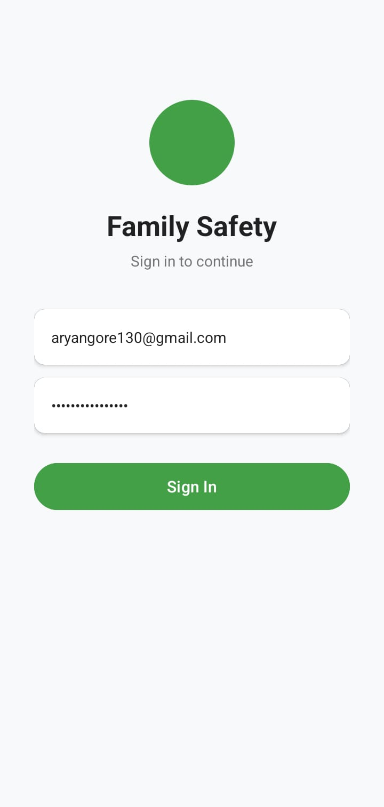
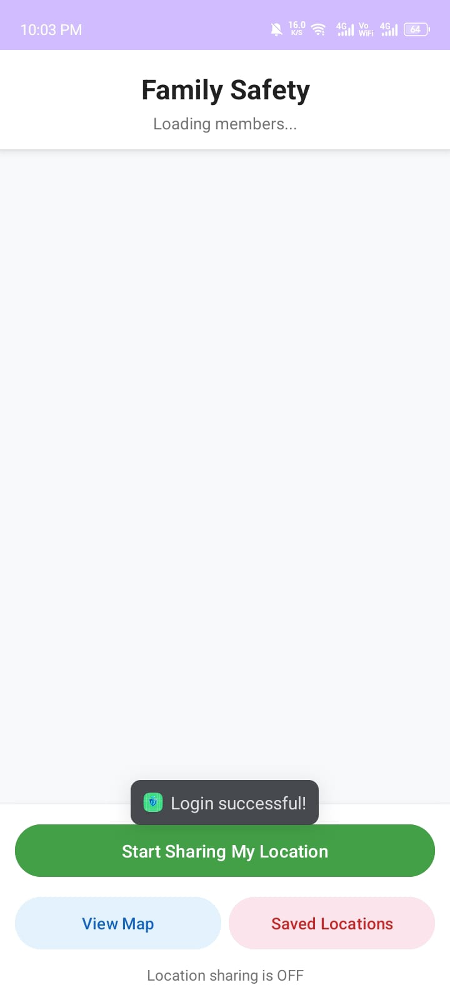
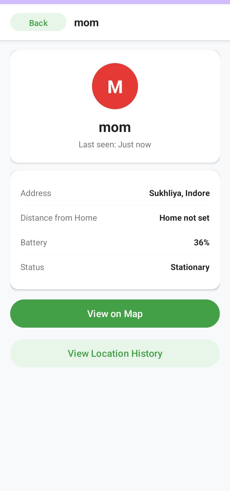
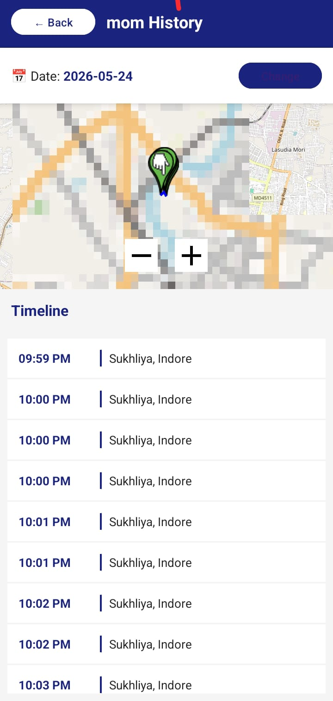
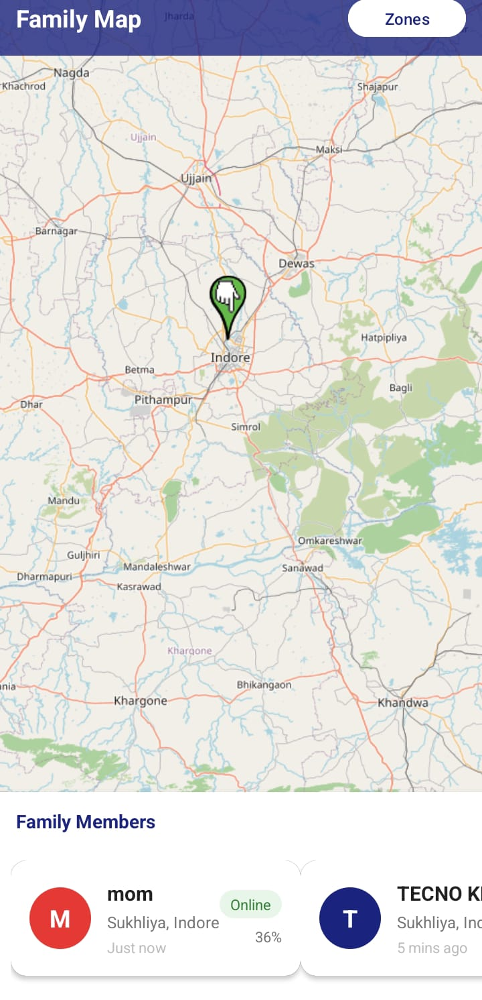

# Family Safety App

A real-time family location tracking Android app built with Java, Firebase, and OpenStreetMap.


## Screenshots
## Screenshots

<table>
  <tr>
    <td align="center">
      <br>
      <b>Login Page</b>
    </td>
    <td align="center">
      <br>
      <b>Login Successful</b>
    </td>
  </tr>

  <tr>
    <td align="center">
      <br>
      <b>Details Screen</b>
    </td>
    <td align="center">
      <br>
      <b>Location History</b>
    </td>
  </tr>

  <tr>
    <td align="center">
      <br>
      <b>Saved Locations</b>
    </td>
    <td align="center">
      <br>
      <b>Map Screen</b>
    </td>
  </tr>
</table>

## Features

- Real-time location tracking on a map
- Background GPS tracking (works when app is closed)
- Family member list with online/offline status
- Individual member detail screen
- Location history with timeline and route
- Saved locations (Home, School, Work, Custom)
- Geofence zones with entry/exit alerts
- Distance calculator from saved Home location
- Battery level display for each device
- Smart tracking (faster when moving, slower when still)
- Different colored pins for each family member
- Admin login with Firebase Authentication
- Auto-restart tracking after phone reboot

---

## Tech Stack

| Component | Technology |
|-----------|-----------|
| Language | Java |
| Map | OpenStreetMap (OSMDroid) |
| Database | Firebase Realtime Database |
| Authentication | Firebase Auth |
| Location | FusedLocationProviderClient |
| Background | Android Foreground Service |
| Min SDK | Android 6.0 (API 23) |

---

## Project Structure

```
app/
├── manifests/
│   └── AndroidManifest.xml
├── java/com/aryan/family_safety/
│   ├── LoginActivity.java
│   ├── SetupActivity.java
│   ├── MainActivity.java
│   ├── MapActivity.java
│   ├── PersonDetailActivity.java
│   ├── HistoryActivity.java
│   ├── LocationsActivity.java
│   ├── PickLocationActivity.java
│   ├── LocationService.java
│   ├── BootReceiver.java
│   ├── MemberAdapter.java
│   ├── DeviceModel.java
│   └── GeofenceHelper.java
└── res/
    ├── layout/
    │   ├── activity_login.xml
    │   ├── activity_setup.xml
    │   ├── activity_main.xml
    │   ├── activity_map.xml
    │   ├── activity_person_detail.xml
    │   ├── activity_history.xml
    │   ├── activity_locations.xml
    │   ├── activity_pick_location.xml
    │   ├── item_member.xml
    │   ├── item_location.xml
    │   └── item_history.xml
    └── drawable/
        ├── circle_green.xml
        ├── circle_green_light.xml
        ├── circle_blue.xml
        ├── circle_red.xml
        ├── circle_orange.xml
        ├── circle_purple.xml
        ├── circle_avatar.xml
        ├── badge_green.xml
        └── badge_grey.xml
```

---

## Firebase Database Structure

```json
{
  "devices": {
    "device_id": {
      "nickname": "Dad",
      "color": "#43A047",
      "latitude": 23.1815,
      "longitude": 79.9864,
      "address": "MG Road, Jabalpur",
      "lastSeen": 1710000000000,
      "battery": 85,
      "isMoving": false,
      "speed": 0.0,
      "isOnline": true
    }
  },
  "history": {
    "device_id": {
      "2026-03-22": {
        "point_id": {
          "latitude": 23.1815,
          "longitude": 79.9864,
          "address": "MG Road, Jabalpur",
          "timestamp": 1710000000000
        }
      }
    }
  },
  "saved_locations": {
    "location_id": {
      "name": "Home",
      "address": "Civil Lines, Jabalpur",
      "latitude": 23.1900,
      "longitude": 79.9900,
      "radius": 200,
      "alerts": true
    }
  }
}
```

---

## Setup Instructions

### 1. Prerequisites
- Android Studio installed
- Firebase account
- Java 11

### 2. Firebase Setup
1. Go to [Firebase Console](https://console.firebase.google.com)
2. Create a new project named `FamilySafetyApp`
3. Add Android app with package name `com.aryan.family_safety`
4. Download `google-services.json` and place in `app/` folder
5. Enable **Realtime Database** in test mode
6. Enable **Authentication** with Email/Password
7. Create an admin account in Authentication > Users

### 3. Clone and Build
1. Open project in Android Studio
2. Wait for Gradle sync to complete
3. Run on device or emulator

### 4. First Time Setup
- **Admin**: Login with Firebase credentials → see family map
- **Family member**: Open app → Setup screen → enter name → pick color → start sharing

---

## How to Add Family Members

### Method 1 - Install APK (Recommended)
```
Build → Build Bundle/APK → Build APK
Share app-debug.apk via WhatsApp or Drive
Family member installs and sets up their profile
```

### Method 2 - Add to Firebase Manually (Testing)
```
Firebase Console → Realtime Database → devices
Add new entry with nickname, color, lat, lng
```

### Method 3 - Android Emulator (Testing)
```
Android Studio → Device Manager → Create Virtual Device
Run app on emulator with different nickname
```

---

## App Flow

```
Login Screen (Admin)
      ↓
Main Screen
  ├── Family member list
  ├── View Map button
  └── Saved Locations button
      ↓
Person Detail Screen
  ├── Name, address, battery
  ├── Distance from Home
  ├── View on Map
  └── View History
      ↓
History Screen
  ├── Date picker
  ├── Timeline list
  └── Route on mini map

Family Member Flow:
Open App → Setup (name + color) → Start Sharing
```

---

## Permissions Required

| Permission | Reason |
|-----------|--------|
| ACCESS_FINE_LOCATION | Precise GPS |
| ACCESS_BACKGROUND_LOCATION | GPS when app is closed |
| FOREGROUND_SERVICE | Background tracking |
| INTERNET | Firebase sync |
| RECEIVE_BOOT_COMPLETED | Restart after reboot |
| WAKE_LOCK | Keep CPU awake for tracking |

---

## Troubleshooting

| Problem | Solution |
|---------|---------|
| App crashes on start | Check google-services.json is in app/ folder |
| Location not updating | Check background location permission is "Allow all the time" |
| Firebase not connecting | Check internet connection and Firebase rules |
| Map not loading | Check internet connection |
| Setup screen not showing | Clear app data in phone settings |
| Members not showing | Check Firebase Realtime Database has data |

---

## Developer

- **Name**: Aryan Gore
- **Package**: com.aryan.family_safety
- **Built with**: Android Studio, Java, Firebase, OSMDroid

---

## License

This project is for personal/educational use only.
Tracking someone without their knowledge or consent is illegal.
Always obtain consent before tracking family members.
